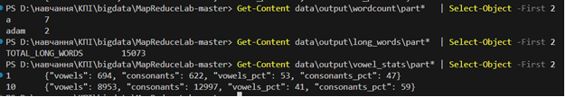

# Bigdata
НАЦІОНАЛЬНИЙ ТЕХНІЧНИЙ УНІВЕРСИТЕТ УКРАЇНИ 
"КИЇВСЬКИЙ ПОЛІТЕХНІЧНИЙ ІНСТИТУТ ІМЕНІ ІГОРЯ СІКОРСЬКОГО” НАВЧАЛЬНО-НАУКОВИХ ІНСТИТУТ АТОМНОЇ ТА ТЕПЛОВОЇ ЕНЕРГЕТИКИ КАФЕДРА ЦИФРОВИХ ТЕХНОЛОГІЙ В ЕНЕРГЕТИЦІ 

ЛАБОРАТОРНА РОБОТА №3
з дисципліни "Обробка надвеликих масивів даних" 

Виконав: студент групи ТР-52мп 
Томін Владислав Вікторович
Перевірив: __________________
____________________________

 
 Київ – 2025

 ----
**Тема**

Застосування та порівняльна оцінка алгоритмів Логістичної Регресії, SVM та Випадкового Лісу для задачі бінарної класифікації.

---

**Мета роботи**

1.	Отримати практичні навички роботи з повним циклом ML.
2.	Навчитись застосовувати обов'язкову попередню обробку даних, зокрема масштабування ознак, та розуміти, на які моделі це впливає.
3.	Навчитись тренувати, налаштовувати та оцінювати три різні за своєю природою моделі класифікації.
4.	Провести порівняльний аналіз моделей, використовуючи відповідні метрики (Accuracy, Precision, Recall, F1-score).

---

**Хід роботи**

Баланс класів
Було перевірено співвідношення класів: приблизно 2/3 benign і 1/3 malignant (357 проти 212). Розбиття train/test виконано зі стратифікацією, тому пропорції збережено (у тесті 72 benign і 42 malignant). З огляду на перекіс, було проаналізовано не лише Accuracy, а й Precision, Recall, F1 — метрики для обох класів вийшли високими, отже рідший клас не ігнорується.

Було завантажено дані, виконано короткий EDA (перевірено типи, відсутність пропусків, базову статистику). Було відмічено суттєві різниці масштабів ознак (наприклад, mean area значно більша за mean radius), тому було застосовано StandardScaler для моделей, чутливих до масштабу.
Було сформовано train/test (80/20, stratify). Було навчено:  
•	Логістичну регресію та SVM (linear і rbf) на масштабованих ознаках.  
•	Random Forest — на немасштабованих ознаках (дерева нечутливі до масштабу).  
Після навчання було отримано прогнози на тесті й обчислено метрики та матриці змішування.  

•	Logistic Regression (LR) — лінійна модель; чутлива до масштабів ознак, тому працює на X_train_scaled/X_test_scaled.  
•	SVM (linear, rbf) — геометричний підхід; також потребує масштабування. RBF дозволяє нелінійні кордони.  
•	Random Forest (RF) — ансамбль дерев рішень; масштабування не потрібне.  

Результати:

 
Найкращі результати показали SVM з rbf-ядром і Логістична регресія (F1 ≈ 0.98). SVM-linear трохи нижча (0.97), Random Forest — ще на крок нижче (0.96). Різниця невелика, бо ознаки інформативні, а класи добре відділяються. Масштабування суттєво впливає на LR/SVM і майже не впливає на RF — це підтверджує різну чутливість алгоритмів до масштабу ознак.

---
**Висновок**

виконано повний процес: дані підготовлено, моделі навчені та порівняні з урахуванням балансу класів. Найкраще себе показали SVM з RBF-ядром та Логістична регресія (F1 ~0.98). Було продемонстровано, що масштабування суттєво впливає на LR/SVM і майже не впливає на Random Forest. Для подальшого покращення доцільно виконати підбір гіперпараметрів (C, gamma для SVM; n_estimators, max_depth для RF) і крос-валідацію для оцінки стабільності.
